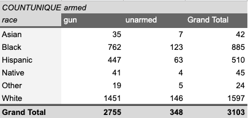

# Headline
>Written by Jason Moscow on August 8th, 2020.

## Here is the CSV
[csvFile](shootings.csv "Title")

## Subheading
Hey my name is Jason and I am analyzing this really cool data. Take a look at what I found here. As you can see,...  
.png "My Chart!")  
_This is how to italicize_  
*This is how to bold*  
Markdown
:   This would be a definition of Markdown

## Subheading
Hey my name is Jason and I am analyzing this really cool data. Take a look at what I found here. As you can see,...  
  
>This is a quote  

## Subheading
### Double subheading
#### Triple subheading!
Hey my name is Jason and I am analyzing this really cool data. Take a look at what I found here. As you can see,...  
.png "My Chart!")  
-This is a list item
-This too

This is the pivot table  
  
